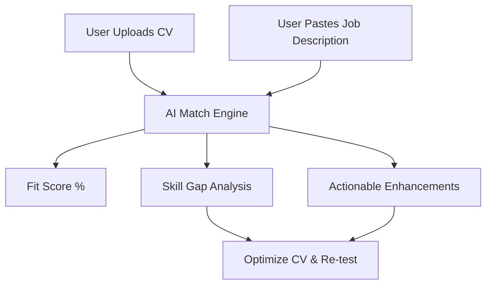

# Product Requirement Document (PRD)
## Job Market Fit (JMF) Analyzer

| **Metadata** | **Details** |
|---|---|
| **Document Owner** | Senior Product Manager (PMF Specialist) |
| **Status** | Draft (Ready for Review) |
| **Target Launch** | Q3 2026 |
| **Version** | v1.0 |

---

## 1. Executive Summary & Product-Market Fit (PMF) Framework

### 1.1 The Problem
Job hunting is currently a numbers game characterized by high friction and low transparency. Job seekers apply to dozens of roles with static CVs, receiving little to no feedback on why they were rejected. Conversely, ATS (Applicant Tracking Systems) screen out up to 75% of candidates based on keyword matching.
*   **The Gap**: Job seekers lack a tool to pre-evaluate their compatibility with a job description *before* applying, leading to wasted effort and anxiety.
*   **The Opportunity**: A lightweight, high-utility tool that tells a user exactly how well they fit a job and—crucially—**how to close the gap**.

### 1.2 The Solution
The **Job Market Fit (JMF) Analyzer** is a web-based utility where users upload their CV (PDF/Docx) and paste a target Job Description (JD). The application utilizes Semantic AI to calculate an overall compatibility percentage and provides detailed, actionable insights into skill gaps, experience alignment, and keyword optimization.



### 1.3 Product-Market Fit (PMF) Hypothesis
1.  **Core Hypothesis**: If we provide job seekers with a fit score that correlates highly with recruiter screening outcomes, they will use it to adapt their CV for every application.
2.  **Engagement Loop**: Unlike typical job boards that users visit once a week, JMF is utilized for *every single application*, creating a highly repeatable usage cycle.
3.  **Monetization / Scale Proxy**: Once users trust the fit score, we can upsell premium features (e.g., automated tailoring, AI cover letters, targeted job feeds matching their 85%+ fit profiles).

---

## 2. Target Personas

### Persona A: "Active Applicant Alex"
*   **Bio**: Recently laid off Software Engineer. Applying to 10+ jobs a day.
*   **Pain Point**: Frustrated by the "black box" of ATS rejection emails.
*   **Needs**: Fast, bulk matching; keyword validation to pass initial screeners.

### Persona B: "Career Pivoter Priya"
*   **Bio**: Marketing Specialist looking to transition into Product Management.
*   **Pain Point**: Doesn't know how to translate transferable skills so that they match PM descriptions.
*   **Needs**: Deep skill-mapping, advice on which keywords/experiences to emphasize.

---

## 3. Product Features & Detailed Specifications

### 3.1 Feature Map
```
Job Market Fit Analyzer
├── Epic 1: Onboarding & Input
│   ├── FR-1.1: CV Upload (PDF/Docx/TXT)
│   └── FR-1.2: Job Description Input (Paste Text/Scrape URL)
├── Epic 2: Core Matching Engine (AI/NLP)
│   ├── FR-2.1: Resume Parsing & Key Entity Extraction
│   ├── FR-2.2: Semantic Compatibility Scoring
│   └── FR-2.3: Weighted Alignment Algorithm
└── Epic 3: Fit Analytics Dashboard
    ├── FR-3.1: Overall Fit Score (Donut Chart)
    ├── FR-3.2: Skill Gap Analysis (Matched vs. Missing)
    └── FR-3.3: Actionable Rephrasing Suggestions
```

### 3.2 Epic 1: Onboarding & Input (High-Level UX)
*   **Goal**: Zero friction. Users should be able to get their first score in under 60 seconds without creating an account (anonymous tier).

#### FR-1.1: CV Upload
*   **Requirements**:
    *   Drag-and-drop zone supporting `.pdf`, `.docx`, and `.txt` up to 5MB.
    *   Client-side parsing validation (toast messages for password-protected or corrupt files).
    *   Visual preview of parsed text snippet to confirm readability.

#### FR-1.2: Job Description (JD) Input
*   **Requirements**:
    *   Large text area (min-character limit: 100 characters to prevent inadequate analysis).
    *   Future enhancement: Paste a URL from LinkedIn, Indeed, or glassdoor, and scrape the JD automatically.

---

### 3.3 Epic 2: The Core Matching Engine
*   **Goal**: Provide a match percentage that is mathematically sound and realistically reflects a recruiter's evaluation.

#### FR-2.1: Extraction
The engine must segment both documents into:
1.  **Hard Skills** (Languages, tools, frameworks, methodologies).
2.  **Soft Skills** (Leadership, communication, management style).
3.  **Experience Level** (Years of experience, seniority keywords).
4.  **Education & Certifications**.

#### FR-2.2: Weighted Match Logic
The overall score is not a simple keyword frequency match. It is calculated using a weighted matrix:
$$\text{Score} = (W_{\text{hard}} \times S_{\text{hard}}) + (W_{\text{exp}} \times S_{\text{exp}}) + (W_{\text{soft}} \times S_{\text{soft}}) + (W_{\text{edu}} \times S_{\text{edu}})$$

| Category | Default Weight | Description |
|---|---|---|
| **Hard Skills** | 45% | Direct match of technical skills and operational tools. |
| **Experience** | 35% | Alignment of years worked, roles held, and industry domain. |
| **Soft Skills** | 10% | Behavioral alignment and culture keywords. |
| **Education/Cert** | 10% | Degrees, certifications (e.g., PMP, AWS Certified) required. |

---

### 3.4 Epic 3: Fit Analytics Dashboard
*   **Goal**: Present the analysis in a stunning, highly visual, and readable layout.

```
+-------------------------------------------------------+
|  [Logo] Job Market Fit                                |
+-------------------------------------------------------+
|  Your Overall Compatibility:                          |
|         ((  82%  ))  -- Great Match!                  |
|                                                       |
|  [Skills Fit: 90%]   [Exp Fit: 75%]   [Edu Fit: 100%] |
+-------------------------------------------------------+
|  Key Gaps Identified:                                 |
|  - Missing Hard Skill: "Kubernetes" (Critical)        |
|  - Missing Experience: "Leading Agile teams"          |
|                                                       |
|  How to improve:                                      |
|  - Add Kubernetes under technical skills if you have  |
|    worked with it in your cloud deployments.          |
+-------------------------------------------------------+
```

#### FR-3.1: Score Visualization
*   Interactive donut chart with dynamic color grading:
    *   `0% - 50%`: Red (Low Match - requires major alignment/upskilling).
    *   `51% - 75%`: Orange/Yellow (Medium Match - minor adjustments needed).
    *   `76% - 100%`: Emerald Green (High Match - ready to apply).

#### FR-3.2: Skill Gap Analysis Table
*   Two-column visual checklist comparing **Required Skills** in the JD against **Found Skills** in the CV.
*   Clearly marks missing skills, highlighted by level of priority (e.g., mentioned multiple times in JD = *Critical Gap*).

#### FR-3.3: AI recommendations (Actionable Enhancements)
*   **Rephrasing Tips**: Suggests sentence modifications. For example:
    *   *System detects*: "Managed database servers" in CV, and "Scale and optimize PostgreSQL databases" in JD.
    *   *System Suggestion*: "Rewrite CV bullet to: 'Optimized and scaled PostgreSQL databases, improving query performance by 25%.'"

---

## 4. Non-Functional Requirements (NFRs)

### 4.1 Performance & Latency
*   Processing time from "Submit" to "Score Rendered" must be **under 4 seconds** for typical 2-page CVs and 500-word JDs.
*   Use skeleton loading states to maintain user attention during backend parsing and LLM inference.

### 4.2 Security, Privacy, & Compliance
*   **Zero Retention Policy**: For anonymous users, uploaded CV files and parsed data must be wiped from memory/servers immediately after the session ends or within 1 hour.
*   **GDPR / CCPA Compliance**: Clearly visible privacy toggle. Users must opt-in to save their data in history.
*   **No Training Data**: Explicitly contract that no user-submitted data is used to train third-party LLMs (e.g., via OpenAI/Vertex API enterprise agreements).

---

## 5. Metrics & Product-Market Fit (PMF) Indicators

To validate that the app is solving a real problem and achieving product-market fit, we will track the following key performance indicators:

| **Metric Category** | **KPI** | **Target** | **Rationale** |
|---|---|---|---|
| **PMF Proxy** | Sean Ellis Test Score | > 45% | "Very disappointed" if JMF was no longer available. |
| **Engagement** | Re-run Rate | 3.5x | Number of times a user re-uploads/optimizes the *same* CV for a job. |
| **Retention** | W1 (Week 1) Retention | > 25% | Users returning to scan new JDs as they apply to more jobs. |
| **Success Utility** | Self-Reported Interview Rate | 2x Increase | User surveys indicating they got an interview within 3 weeks of using an 80%+ fit CV. |

---

## 6. Phase 1 Release Criteria (MVP vs. Phase 2)

| Feature | MVP | Phase 2 |
|---|:---:|:---:|
| **CV Upload (PDF/Docx)** | Yes | Yes |
| **JD Paste Text** | Yes | Yes |
| **Overall Fit Score %** | Yes | Yes |
| **Hard Skill Gap Analysis** | Yes | Yes |
| **JD Scraping via URL** | No | Yes |
| **Interactive CV Editor (Inline)** | No | Yes |
| **Auto-tailor CV (One-click export)** | No | Yes |
| **Job Market Match Feed** | No | Yes |
